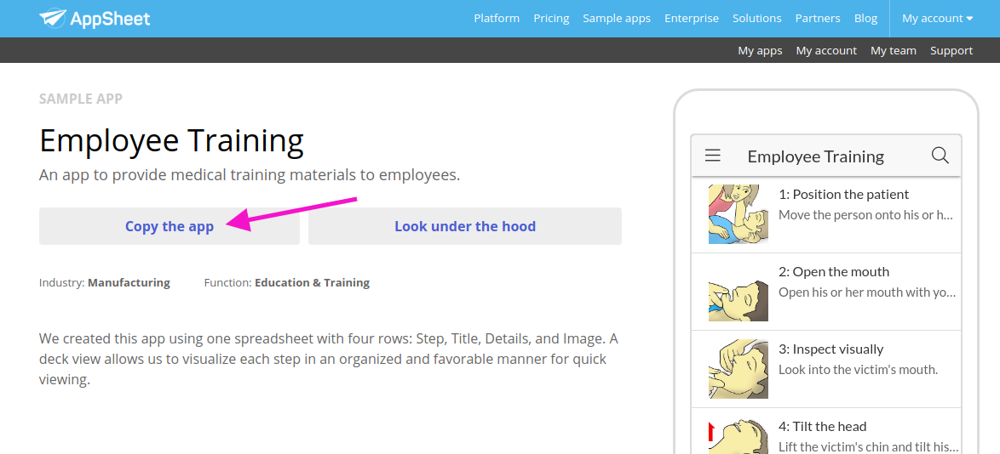
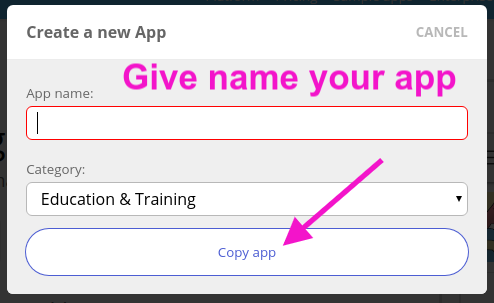
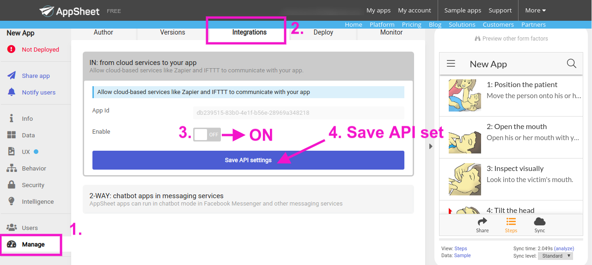
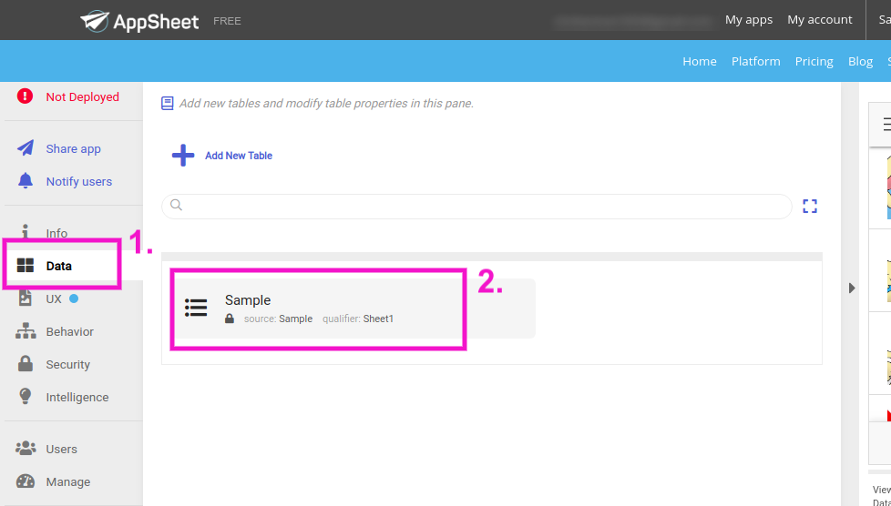
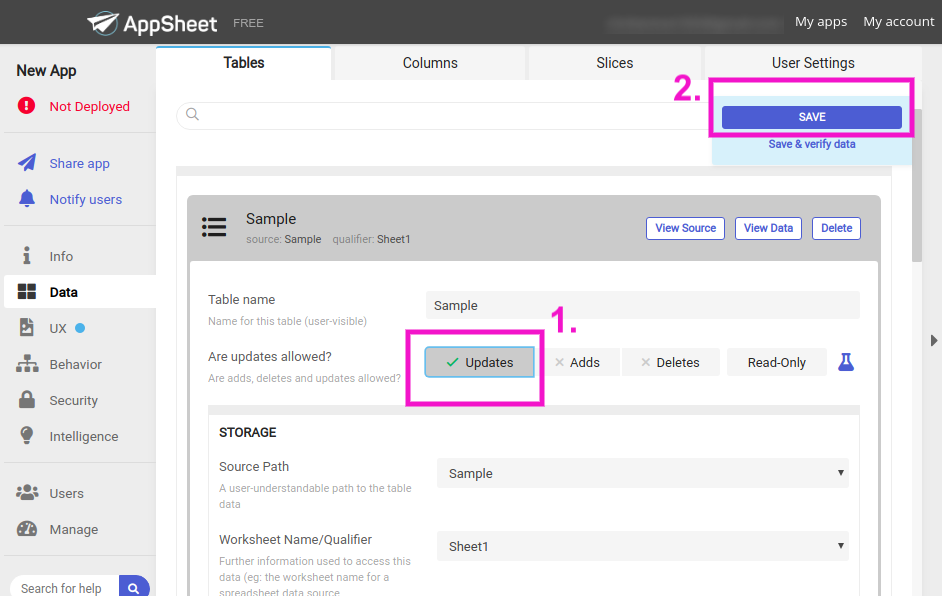
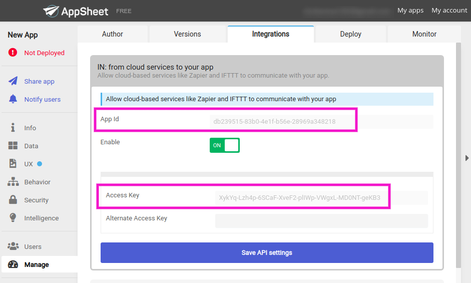
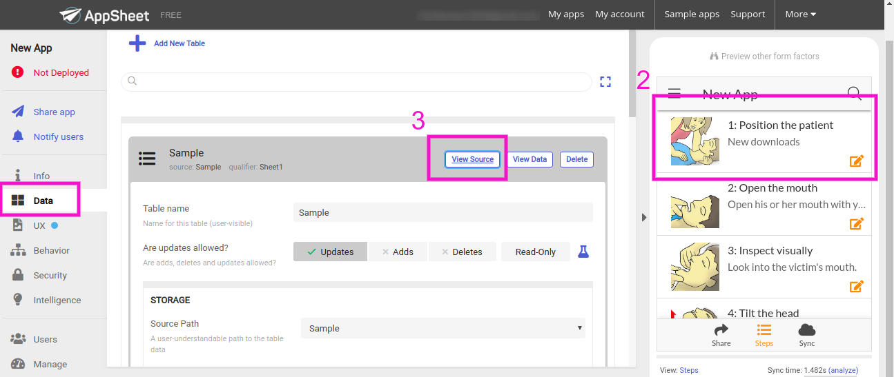

# Cypress-appsheet-sample-integration-testing
This app will do integration testing between appsheet.com - googlesheet - cypress.js

### Pre installation App at AppSheet:

1) Go to <a href="https://www.appsheet.com/samples/An-app-to-provide-medical-training-materials-to-employees?appGuidString=a5b1f447-ee56-4093-8852-dceedf407bfd"> App link </a> and loggin. 

2) Copy the App (watch pic down)


3) Give name your App and Click Copy


4) Go to Manage - Integrations - Unable to ON - Save API set


5) Go to Data - Tables - Choose Sample


6) Allow Updates and press Save



### To Install the cypress:

1) Download cypress file frop <a href="https://github.com/marinashinkareva/cypress-appsheet-sample-integration-testing"> Git repository </a>, extract and copy to your folder.

2) Run at terminal <b>npm install</b>.

3) Run at terminal <b>code .</b>

After opening files at code:
Go to folder <i>Cypress - Integration - IntegrationTest - network_requests.spec.js</i>

Paste your App ID in the row 
```js
url: 'https://api.appsheet.com/api/v1/apps/<strong>SHOULD BE APP ID FROM STEP 2 (Go to Manage - Integrations)</strong> /tables/Sample/Action', // baseUrl is prepended to url
```

Paste your Access Key in the row 
```js
'ApplicationAccessKey': '<strong>SHOULD BE Access Key FROM STEP 2 (Go to Manage - Integrations)</strong>'
```

Write some text here:
```js
Rows: [
          {
            Step: '1: Position the patient',
            Title: 'New downloads',
            Details: '33',
            Image: 'New.Step1.jpg'
```
App ID and Access Key in your app:


4) Run at terminal <b>npm start</b>.

5) Starting up http-server, serving app
```js
Available on:
  http://127.0.0.1:8080
  ```
 
6) Run at new terminal tab <b>node_modules/.bin/cypress open</b>.

At cypress window app click button <b>network_requests.spec.js</b>

Wait till testing done:


7) There are 2 ways check updates:

 1 - Updates shoud upper on the right side on mobile application
 2 - Go to Data - Sample - Click View Source

 
 
That`s all :-)
